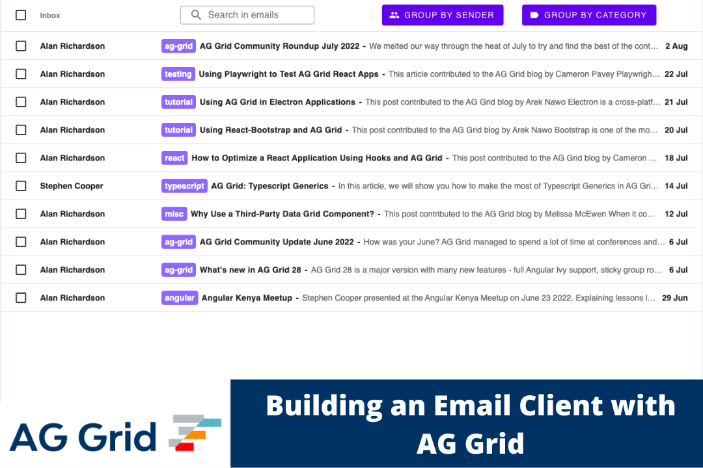

# AG Grid Mail

This repository contains the source code for the application, for a detailed explanation please see the [accompanying blog post](https://blog.ag-grid.com/build-email-client-with-ag-grid-like-gmail/) which explains the implementation.

To see the application running, open [https://shuheb.github.io/ag-grid-mail/](https://shuheb.github.io/ag-grid-mail/) to view it in the browser.

## Installation

In the project directory, install the dependencies:
### `npm install`

To run the app in development mode:
### `npm run start`

Open [http://localhost:8080](http://localhost:8080) to view it in the browser.